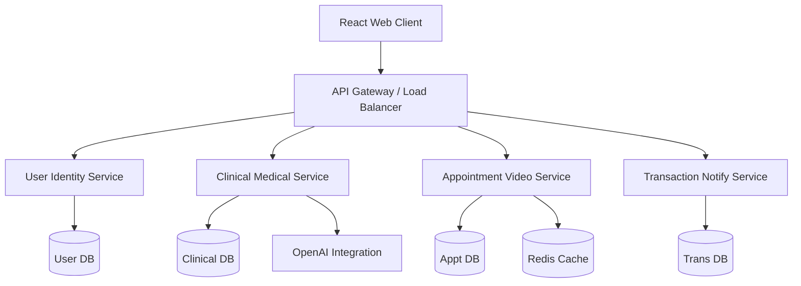

# 🏥 Medicate - Smart Healthcare Platform

## 📝 Description

**Medicate** is a cloud-native, AI-enabled healthcare platform that streamlines the consultation lifecycle using a microservices architecture. It bridges the gap between patients and doctors through AI-driven symptom assessment, secure video consultations, and digital prescription management. 

Designed for scalability and resilience, the platform leverages modern distributed systems patterns to ensure high availability and seamless user experiences across the entire patient journey.

---

## ✨ Key Features

- **🤖 AI-Driven Symptom Assessment**: Intelligent preliminary analysis to guide patients to the right care.
- **📹 Secure Video Consultations**: Real-time, encrypted telehealth sessions integrated with scheduling.
- **📋 Digital Prescription Management**: Streamlined medical record tracking and prescription issuance.
- **💳 Integrated Financial Workflows**: Automated payment processing and transaction notifications.
- **🔐 Enterprise-Grade Security**: Role-based access control (RBAC) and robust identity management.
- **📊 Real-time Dashboard**: Interactive, data-driven interfaces for patients, doctors, and admins.

---

## 🏗️ Architecture Overview

The platform follows a **decoupled microservices architecture** where each service manages its own data domain and communicates via RESTful APIs and event-driven patterns.



---

## 🧩 Services Breakdown

| Service | Description | Core Responsibilities |
| :--- | :--- | :--- |
| **`user-identity-service`** | Identity Provider | Authentication, JWT management, RBAC, Admin controls. |
| **`clinical-medical-service`** | Medical Core | Doctor profiles, EHR management, OpenAI-powered AI diagnostics. |
| **`appointment-video-service`** | Telehealth Hub | Slot booking, Agora video integration, real-time availability. |
| **`transaction-notify-service`** | FinOps & Comms | Stripe payments, transaction history, Email/SMS notifications. |

---

## 📋 Prerequisites

Before you begin, ensure you have the following installed:

- **Runtime**: [Node.js v18+](https://nodejs.org/)
- **Containerization**: [Docker Desktop](https://www.docker.com/products/docker-desktop/)
- **Orchestration**: [Kubernetes](https://kubernetes.io/) (kubectl) for production-like testing
- **API Keys**: Access to OpenAI, Stripe, Agora, and Cloudinary

---

## ⚙️ Installation & Setup

### 1. Clone the Repository
```bash
git clone <repository-url>
cd Medicate
```

### 2. Environment Configuration
Create a `.env` file in the root directory based on `.env.example`:
```bash
cp .env.example .env
```
Ensure you provide values for `JWT_SECRET`, `STRIPE_SECRET_KEY`, `OPENAI_API_KEY`, and `AGORA_APP_ID`.

### 3. Local Development (Docker)
Build and start all services using Docker Compose:
```bash
docker-compose up --build
```

---

## 🚀 Usage Instructions

Once the containers are healthy:

- **Web Dashboard**: Access the application at [http://localhost:3000](http://localhost:3000).
- **Service Endpoints**:
  - Identity Service: `http://localhost:3001`
  - Clinical Service: `http://localhost:5001`
  - Appointment Service: `http://localhost:5004`
  - Transaction Service: `http://localhost:3004`
- **Default Admin**: Use the credentials configured in your `.env` file to log in to the management portal.

---

## 🚢 Deployment Guide

### Local / Development
For rapid iteration, use **Docker Compose** as described in the Installation section. This manages MongoDB and Redis instances alongside the application services.

### Production / Kubernetes
The project includes production-ready Kubernetes manifests in the `k8s/` directory.

1. **Namespace Setup**:
   ```bash
   kubectl apply -f k8s/common/namespace.yaml
   ```
2. **Infrastructure Layer**:
   Apply ConfigMaps and Secrets first:
   ```bash
   kubectl apply -f k8s/common/
   ```
3. **Application Layer**:
   Deploy individual services:
   ```bash
   kubectl apply -f k8s/appointment-service/
   kubectl apply -f k8s/web-client/
   # ... repeat for other services
   ```

*For a deep dive into K8s orchestration, refer to [DOCKER_KUBERNETES_SETUP.md](./DOCKER_KUBERNETES_SETUP.md).*

---

<p align="center">
  <b>Medicate</b> • Delivering the Future of Healthcare Today
</p>
